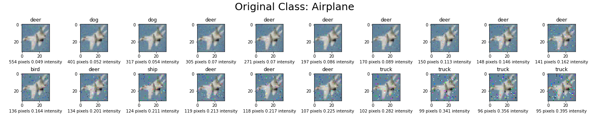

# multiobjective_adversarial_examples
Deep neural networks, like ResNet and VGG16, are very accurate in classifying images, but they can be caused to misclassify if some of the pixels in the image are changed. To the human eye, these pixel changes are either nearly imperceptible or do not affect the semantic meaning of the image. This phenomenon, known as [adversarial examples](https://pyimagesearch.com/2020/10/19/adversarial-images-and-attacks-with-keras-and-tensorflow/), is hotly studied in academia to improve the security of neural networks.

Adversarial example algorithms typically measure the difference between the input image and the adversarial image using a [norm](https://montjoile.medium.com/l0-norm-l1-norm-l2-norm-l-infinity-norm-7a7d18a4f40c), and will then seek to minimize the norm. Almost every  algorithm in the literature will minimize just one of these norms. My algorithm is unique in that it minimizes both the l-0 norm (number of pixels changed) and the l-infinity norm (maximum amount of change applied to each pixel). For a given input image, the algorithm returns a [pareto front](https://en.wikipedia.org/wiki/Pareto_front) of adversarial images that vary by the number of pixels changed. To illustrate how this works, below is an example of a fighter jet image from the [CIFAR10 dataset](https://en.wikipedia.org/wiki/CIFAR-10):

  

After running this input image in my algorithm, these 20 perturbed images are returned. From top left to bottom right, the images decrease in the number of pixels changed but each pixel is changed by a greater amount.

The optimality of each solution can be visualized in the pareto front below:

  

I think a multiobjective adversarial attack is a neat opportunity to measure the vulnerabilities of neural networks. Are some networks, like ResNet, less vulnerable to sparse attacks than others? I will upload the results of my experiments here soon where I hope to show insights on how this algorithm affects different neural network architectures.
