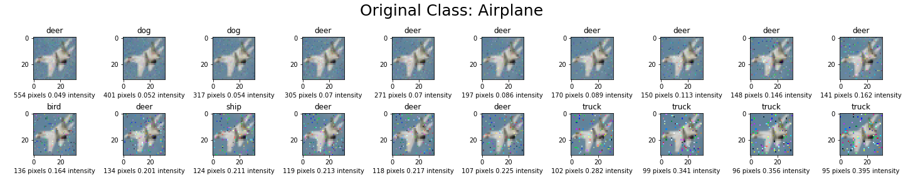

# Multiobjective Adversarial Examples
Deep neural networks, like ResNet and VGG16, are very accurate in classifying images, but they can be caused to misclassify if some of the pixels in the image are changed. To the human eye, these pixel changes are either nearly imperceptible or do not affect the semantic meaning of the image. This phenomenon, known as [adversarial examples](https://pyimagesearch.com/2020/10/19/adversarial-images-and-attacks-with-keras-and-tensorflow/), is hotly studied in academia to improve the security of neural networks.

Adversarial example algorithms typically measure the difference between the input image and the adversarial image using a [norm](https://montjoile.medium.com/l0-norm-l1-norm-l2-norm-l-infinity-norm-7a7d18a4f40c), and will then seek to minimize the norm. Almost every  algorithm in the literature will minimize just one of these norms. My algorithm is unique in that it minimizes both the l-0 norm (number of pixels changed) and the l-infinity norm (maximum amount of change applied to each pixel). For a given input image, the algorithm returns a [pareto front](https://en.wikipedia.org/wiki/Pareto_front) of adversarial images that vary by the number of pixels changed. To illustrate how this works, below is an example of a fighter jet image from the [CIFAR10 dataset](https://en.wikipedia.org/wiki/CIFAR-10):

  

After running this input image in my algorithm, these 20 perturbed images are returned. From top left to bottom right, the images decrease in the number of pixels changed but each pixel is changed by a greater amount.

The optimality of each solution can be visualized in the Pareto Front below:

  

The shape of the front can tell you something about the model's vulnerabilities to that image. This is because the nearer the points are to the axes, the more vulnerable the image is to adversarial attacks. Also, which axis the points are closer to will tell you which norm the model is more vulnerable to for that image. In the above plot for instance, the points are slightly closer to the y-axis than they are to the axis. This indicates that for this image, the model is more vulnerable to attacks that minimize the l-infinity norm than they are to attacks that minimize the l-0 norm.

I studied the results of my algorithm on 100 images from the CIFAR10 dataset and on 3 neural network models (3 ResNet models, 1 standard and 2 trained on adversarial examples). Results for each class are aggregated together to reveal distinct vunlerabilities for each class of image. To see the full results of the study, please read the attached research report.

I think this introduces an interesting area of research in the field of adversarial attacks that my work has only scratched the surface of. Some opportunities for future research include studying how the results of a multi-objective attack algorithm differ across different neural network architectures (eg. VGG16, MobileNetV2). My study only included CIFAR10 images, and scaling the algorithm to [ImageNet](https://www.image-net.org/) images would also be a valuable direction. Feel free to fork this repository if you would like to build your own multi-objective adverarial attack algorithm.
